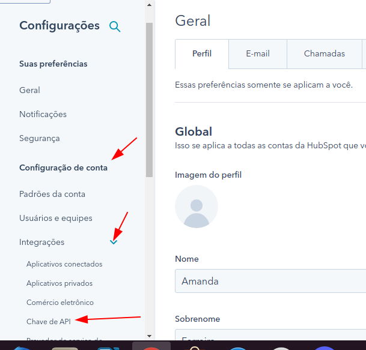

<h2>Desafio Integração</h2>

   Esta aplicação irá importar os contatos da sua planilha google spreadsheet na sua conta do Hubspot.

<h4>Requisitos:</h4>

<ul>
<li>
node v10.24.1 ou superior;
</li>
<li>

Planilha google spreadsheets de contatos, com as seguintes colunas preenchidas:

company, firstname, lastname, email, phone, website. 

</li>
<li>
Conta no Hubspot. 
</li>
</ul>

<h6>Passo a passo resumido:</h6>
<li>1 - clonar projeto</li>
<li>2 - renomear .env-example para .env</li>
<li>3 - seguir as instruções do item 3 para configurar a .env</li>
<li>4 - rodar npm install</li>
<li>5 - rodar npm run start</li>
<li>6 - Criar credenciais de conta de serviço google e importá-la neste projeto com o nome "credentials.json" (apenas a partir de 09/06/2022).</li>

## Passo a passo para configuração: 

1 => Após clonar o projeto, acessar a pasta do projeto, via terminal, e rodar o comando "npm install", para instalar as dependências do projeot.

2 => Renomear o arquivo .env-example para .env

3 => No arquivo .env estão definidas 3 variáveis de ambientes:

    HUBSPOT_API_KEY = "your hubspot apikey comes here"
    WORKSHEET_ID = "the id of your google spreadsheet comes here."
    SHEET_TITLE = "the title of your google spreadsheet comes here." 

    Você deverá setar esses valores, ou seja, atribuir valores reais às variáveis HUBSPOT_API_KEY, WORKSHEET_ID e SHEET_TITLE.
    Para isso, siga as seguintes instruções para conseguir essas informações.

4 => Capturando os valores a serem atribuídos às variáveis de ambiente: 

    4.1 => HUBSPOT_API_KEY :

        Acesse o site https://app.hubspot.com , e faça o login. 

        Clique no botão de configurações, localizado no menu superior. 
        </img>
        

        Agora role pelo menu lateral até "Configurações de conta", clique no submenu dropdown "Integrações" e selecione "Chave de API":
        

        Caso você nunca tenha gerado uma Chave de Api na plataforma, irá aparecer um botão para criar Chave de Api. Clique nele e copie a chave gerada. Caso já tenha Chave de Api cadastrada, apenas clique em "Mostrar" e copie a chave.
        Pronto, agora você já tem o valor da s/ua chave de api da hubspot. 
        

        Volte no arquivo .env e cole a chave dentro das aspas:
        HUBSPOT_API_KEY = "your hubspot apikey comes here".

    4.2 => WORKSHEET_ID :
        Abra sua planilha google, com seus contatos preenchidos, e capture a sequência de caracteres que inicia após o /d/ , e termina antes do /edit
        

        WORKSHEET_ID = "the id of your google spreadsheet comes here."

    4.3 => SHEET_TITLE :
        A sua planilha google pode conter várias "folhas", conforme ilustra a figura a seguir.
        

        O valor da variável SHEET_TITLE deve ser exatamente igual ao nome da folha. Neste exemplo: Página1.
        SHEET_TITLE = "Página1" 

Pronto, agora suas variáveis de ambiente estão setadas. Salve as alterações do arquivo .env, e feche-o.

### Atenção!!!
#### Este projeto já está com uma credencial google importada (credentials.json). Para que o desafio possa ser executado sem que haja necessidade dessa configuração. Porém essa não é uma boa prática de programação e segurança. Portanto, em 15 dias irei tirar esse arquivo deste repositório (em 09/06/22). E, a partir de então, será necessário configurar uma conta de serviço google e importá-la neste projeto. Para isso, siga as instruções do item 5. 

5 => Configurar as credenciais do Google Cloud. Você precisará criar uma Conta de Serviço e uma chave de acesso. 

    Acesse o site https://cloud.google.com/
    Caso sua conta google não esteja logada, você deverá:
            Clicar em "Fazer Login", no menu. Conforme indicado na figura a seguir:
            
            
            Selecionar sua conta google.
            Inserir sua senha e fazer o login.
            
    Agora, no ambiente logado, clique no menu "Console":
            
                
    Agora, na Google Cloud Platform, clique para selecionar um projeto:
            
                
    Caso não tenha nenhum projeto criado, clique em "novo projeto". Caso já tenha projeto criado, selecione. 
            
                
    Caso tenha clicado em novo projeto, dê um nome ao projeto e clique em "criar"
            
                
    Você será redirecionado para a tela anterior. Então clique em "Selecionar um projeto", e selecione o projeto.
            
                
    Você será redirecionado novamente para a página anterior, porém agora o projeto está carregado. Então clique no menu de informações, e em seguida em "Configurações do projeto":
            
            
                
    Agora, no menu lateral esquerdo, clique em "Contas de serviço":
            
                
            Clique em "Criar Conta de Serviço":
            

                Passo 1:   
                 
                    Preencha o nome, e então o id será preenchido automaticamente. Preencha a descrição da conta
                    Clique em "Criar e continuar":
                    
                    Exemplo:
                    

                Passo 2:

                    Selecionar Papel.  
                    
                    Acesso rápido : selecione "Básico" e depois o papel "Proprietário"
                    
                    Clique em "continuar.
                    

                Passo 3:
                Não é necessário preencher os campos, apenas clique em "concluir".
                

        Agora, no painel das contas de serviços, clique sob a conta de serviço recém criada:
        

        Agora clique em "CHAVES":
        

        Clique em "ADICIONAR CHAVE"
        

        E, em seguida, em "Criar nova chave"
        

        Tipo de chave: JSON
        Clique em "CRIAR".
        

        Será exibido um alerta de que a chave privada foi salva no seu computador, e um arquivo .json será baixado automaticamente em seu computador:
        

    Vá até a pasta em que o arquivo foi baixado e o renomeie para credentials.json.

    Agora mova esse arquivo para dentro da pasta deste projeto.
        
    OBS: Este arquivo "credentials.json" contém as credenciais de acesso da aplicação aos serviços google. Será necessário para a aplicação ter acesso à sua planilha google.
    

6 => Só faltar fazermos com que sua planilha google dê acesso de edição a esta aplicação.

        Copie o email gerado no credentials.json:
        

       Abra sua planilha google e clique em "Compartilhar". Em seguida cole o client_email no campo "Adicione pessoas e grupos", e clique em "Enviar"
       
       
    

    Agora esta aplicação já está com todas as informações e permissões necessárias para integrar os contatos da sua planilha google com sua conta no Hubspot.

7 => Agora, dentro da pasta deste projeto, via terminal, rode o comando "npm run start".
    Esse comando iniciará a aplicação.

    Os contatos da sua planilha serão cadastrados na sua lista de Contatos do Hubspot.
    Caso a planilha contenha algum contato e-mail inválido, não corporativo, ou já importado no hubspot, a aplicação não os enviará para o hubspot. 

### REFERÊNCIAS

link de ajuda para criação da conta de serviço do google:
https://cloud.google.com/docs/authentication/production?hl=pt-br

Google SpreadSheet
https://github.com/theoephraim/node-google-spreadsheet

Hubspot Api Client
https://www.npmjs.com/package/@hubspot/api-client

Email Validator
https://www.npmjs.com/package/email-validator

Company Email Validator
https://www.npmjs.com/package/company-email-validator

Manipulando Google Spreadsheet com Node.js (v1)
https://jvvoliveira.medium.com/manipulando-google-sheets-com-node-js-4a551c68b270

                    
                        
